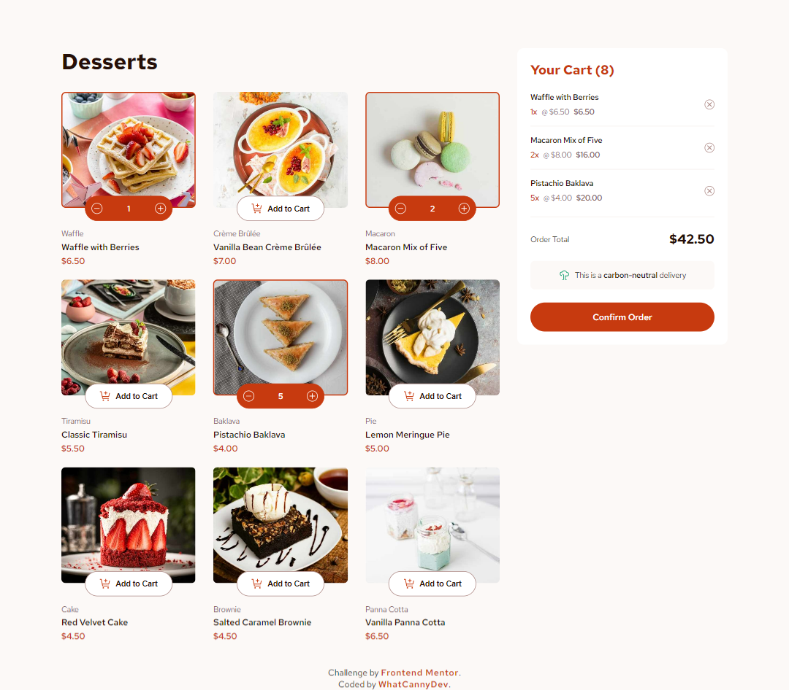

# Frontend Mentor - Product list with cart solution

This is a solution to the [Product list with cart challenge on Frontend Mentor](https://www.frontendmentor.io/challenges/product-list-with-cart-5MmqLVAp_d). Frontend Mentor challenges help you improve your coding skills by building realistic projects. 

## Table of contents

- [Overview](#overview)
  - [The challenge](#the-challenge)
  - [Screenshot](#screenshot)
  - [Links](#links)
- [My process](#my-process)
  - [Built with](#built-with)
  - [About Angular 18](#about-angular-18)
  - [What I learned](#what-i-learned)
  - [Continued development](#continued-development)
  - [Useful resources](#useful-resources)
- [Author](#author)

## Overview

### The challenge

Your challenge is to build out this product list project that includes a functional cart and get it looking as close to the design as possible. You can use any tools you like to help you complete the challenge. So, if you have something you'd like to practice, feel free to give it a go. We provide the data for the products in a local `data.json` file. So you can use that to populate the UI dynamically if you choose.

Users should be able to:

- Add items to the cart and remove them
- Increase/decrease the number of items in the cart
- See an order confirmation modal when they click "Confirm Order"
- Reset their selections when they click "Start New Order"
- View the optimal layout for the interface depending on their device's screen size
- See hover and focus states for all interactive elements on the page

### Screenshot

### Links

- Solution Repository URL: [Click here](https://github.com/CannyRo/FrontendMentor_ProductListWithCart_5MmqLVAp_d)
- Live Site URL: [Click here](https://cannyro.github.io/FrontendMentor_ProductListWithCart_5MmqLVAp_d/)

## My process

### Built with

- HTML5
- CSS custom properties
- Flexbox
- CSS Grid
- Mobile-first workflow
- Typescript
- Signals
- RXJS
- [Angular 18](https://angular.dev/) - JS library

### About Angular 18

This project was generated with [Angular CLI](https://github.com/angular/angular-cli) version 18.2.6.

- Run `ng serve` for a dev server. Navigate to `http://localhost:4200/`. The application will automatically reload if you change any of the source files.
- Run `ng build` to build the project. The build artifacts will be stored in the `dist/` directory.

To get more help on the Angular CLI use `ng help` or go check out the [Angular CLI Overview and Command Reference](https://angular.dev/tools/cli) page.

### What I learned

Some bases of Angular 18, Typescript and Signals.

### Continued development

Continue to create increasingly complex Angular applications.

### Useful resources

- [Angular 18](https://angular.dev/) - This helped me for everything!!! Yes the documentation is better than ChatGPT (but it can still be useful for understanding certain concepts, functions, patterns, etc...).

## Author

- Website - [WhatCannyDev is searching a work-study contract in France](https://cannyro.github.io/hire_mr_canny/en)
- Frontend Mentor - [@CannyRo](https://www.frontendmentor.io/profile/CannyRo)
- GitHub - [@CannyRo](https://github.com/CannyRo)
- LinkedIn - [Ronan CANNY](https://www.linkedin.com/in/ronan-canny-b29443277/)